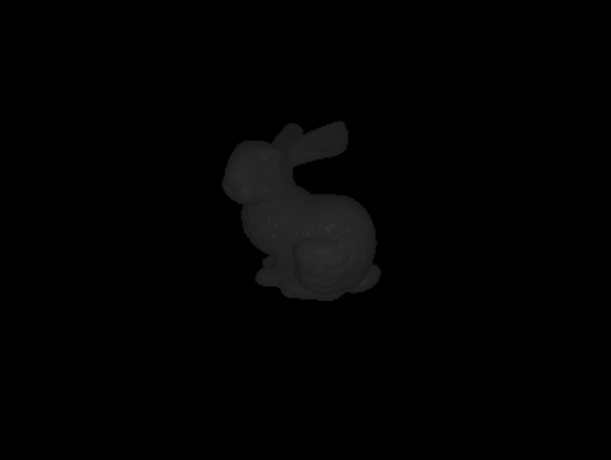
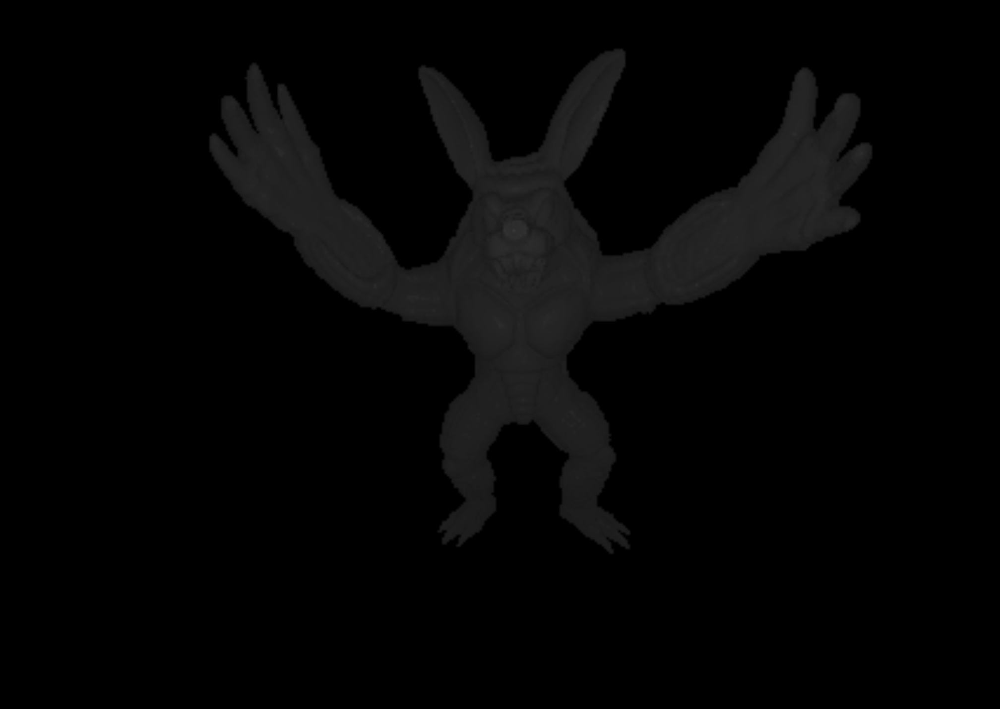
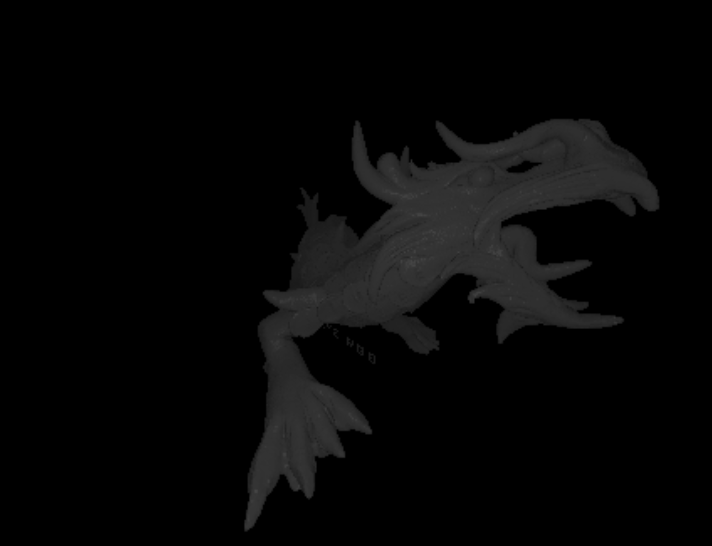
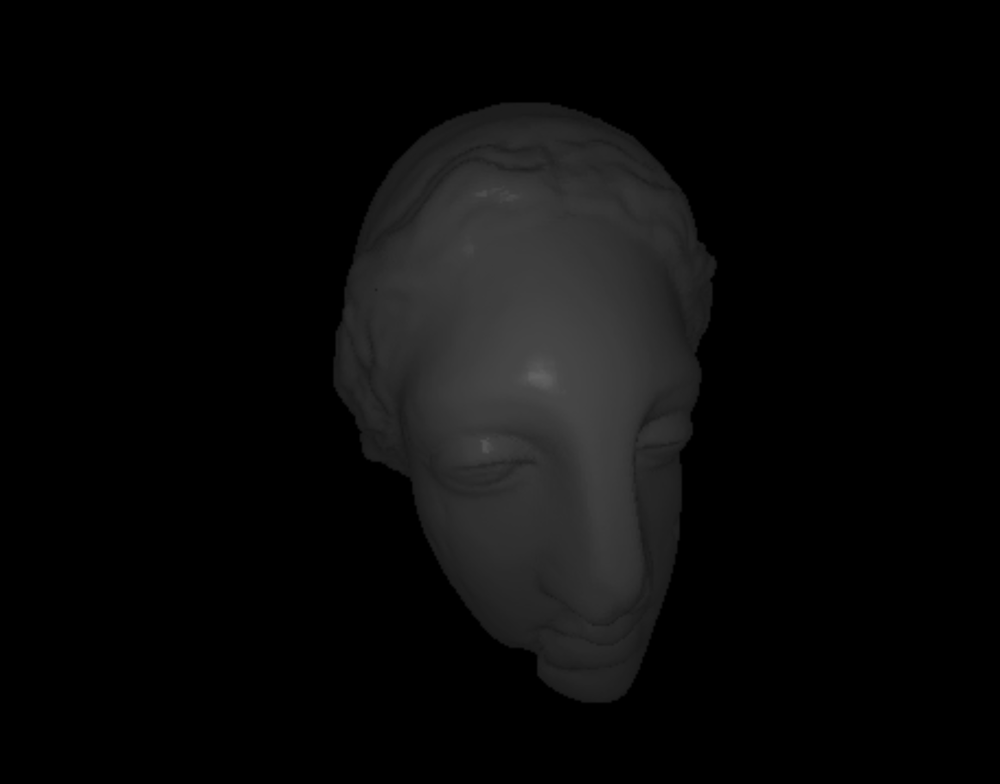

# Simple ray-tracer accelerated using kd-tree

This project demonstrates acceleration performed by kd-tree employed for ray-tracing. 

We used examples provided by [this repo](https://github.com/alecjacobson/common-3d-test-models).
Our ray-tracer accepts only triangle meshes without color and material properties. To apply on the
input from [the repo](https://github.com/alecjacobson/common-3d-test-models) you need to preprocess input obj files 
by our processor `input_transform.py`. Change input filepath inside the file

```python
file = open("data/input_obj_file")
```

to your filename. The output will be in `output.obj`. Modify accordingly. To apply ray-tracer on your file 
update this line in `main.cpp`:
```cpp
ObjParser obj_parser = ObjParser("data/output.obj");
```

with your filename. 

Some of the generated models:






GH link - https://github.com/sio13/ray-tracing-kdtree